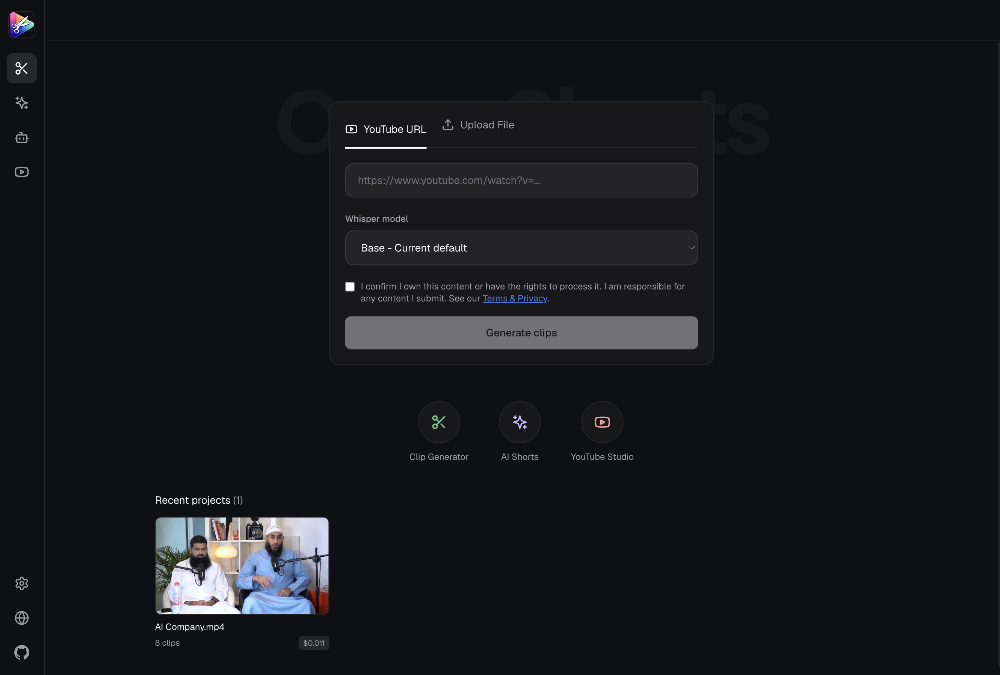
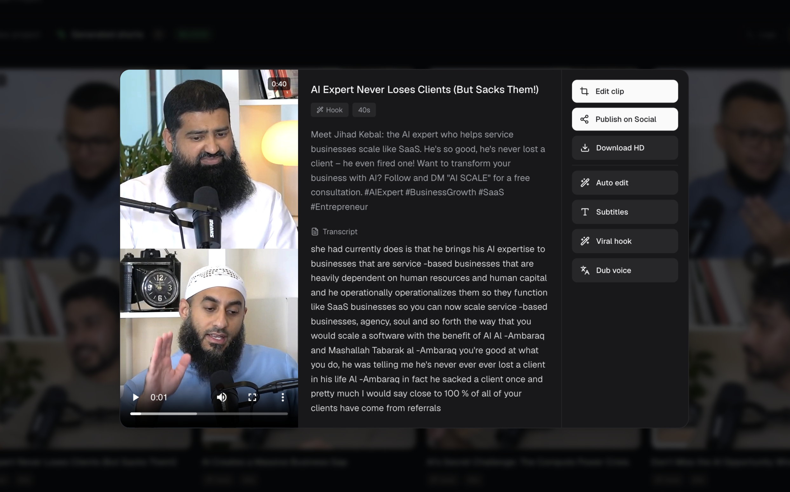
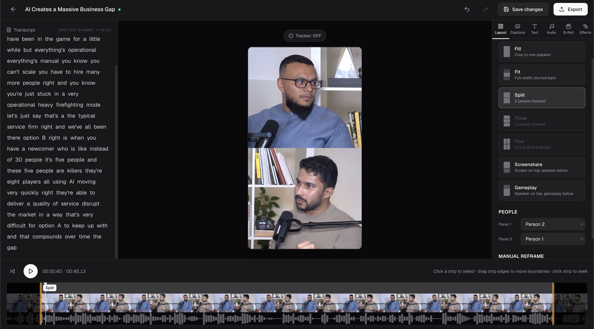

# OpenShorts.app

[](https://opensource.org/licenses/MIT)
[](https://opensource.org/)
[](http://makeapullrequest.com)
[](https://docs.docker.com/compose/)
[](https://github.com/mutonby/openshorts)
[](https://github.com/mutonby/openshorts/commits/main)

**Free & open source AI video platform** with 2 tools in one: **Clip Generator** and **YouTube Studio**. Self-hosted with Docker. No watermarks, no limits.

This fork keeps the original OpenShorts idea, then adds a more complete creation workflow: saved projects, multi-video processing, a clip review grid, and a real editor so you can fix clips before publishing.

https://github.com/user-attachments/assets/b45fa983-16b4-48b5-ac5b-a267836b9ad9

---

## What This Fork Adds

The original OpenShorts is great at turning long videos into short clips. This fork is focused on what happens next: reviewing, fixing, editing, exporting, and publishing those clips without leaving the app.

In plain English:

1. Upload one video or many videos.
2. Let AI find the best short moments.
3. Review the generated clips.
4. Open a clip in the editor if the framing, captions, or timing need work.
5. Export or publish the final version.

The biggest editing upgrade is **multi-person framing**. Older auto-cropping workflows usually pick one face, crop around that person, and bake that choice into the final video. If the wrong person is centered, or if two speakers should both be visible, you are stuck.

This fork keeps the source video and framing data separate. That means you can reopen a clip and choose how it should look:

- **Fill**: focus on one speaker.
- **Fit**: show the full video with blurred space around it.
- **Split**: stack two people in the same vertical short.
- **Three / Four**: keep more speakers visible when the clip needs the full conversation.
- **Screenshare / Gameplay**: keep the main content visible while still showing the speaker.

So instead of AI making one permanent crop, the editor lets you decide who should be on screen.

## Screenshot Tour

### Start from a simple dashboard

Paste a YouTube URL or upload videos. The app keeps recent projects, shows job status, and lets you keep working while other videos are processing.



### Review every generated clip

After processing, clips appear in a grid with titles, durations, cost, logs, downloads, scheduling, and publishing actions.


### Open one clip and decide what to do next

Each clip can be previewed before you commit to anything. From the clip view, you can edit, publish, download, auto-edit, add subtitles, generate a stronger hook, or dub the voice.



### Fix clips in the built-in editor

The editor is the biggest difference in this fork. It lets you adjust the clip after AI creates it. You can work with the transcript, timeline, layout, captions, text, audio, b-roll, and export.



The screenshot above shows the new layout controls. A clip can use Fill, Fit, Split, Three, Four, Screenshare, or Gameplay layouts. This is especially useful for podcasts, interviews, panels, debates, courses, and screen recordings where more than one person or thing matters.

## Original OpenShorts vs This Fork

| Area | Original OpenShorts | This enhanced fork |
|---|---|---|
| Main goal | Generate shorts quickly | Generate shorts, review them, edit them, then publish |
| Dashboard | Basic processing and results flow | App-style dashboard with sidebar tools, recent projects, status, logs, and delete-from-recents |
| Uploads | One URL or one uploaded file at a time | Select or drag in multiple videos and queue them as separate jobs |
| Project history | Jobs mostly live in backend memory | Recent projects are saved in the browser with thumbnails, status, cost, and clip count |
| Clip review | View generated clips | Review clips in a grid with logs, downloads, scheduling, and social publishing actions |
| Editor | Mostly baked output clips | Full clip editor with timeline, transcript, layouts, captions, text, audio, b-roll, and effects |
| Framing | Auto-framed output | Saved framing data, so you can reopen a clip and fix the shot later |
| Multi-person clips | Usually follows one main face or uses a simple fit/fill crop | Keep two, three, or four people visible with Split, Three, and Four layouts |
| Tracking | Crop choice is baked into the exported video | Track who matters, change the layout, and export again without reprocessing the whole video |
| Timeline edits | Mostly automatic | Trim clip edges, split segments, and cut or restore transcript words |
| Export | Final files are created by the pipeline | Editor exports through the render service so preview and export use the same edit data |
| Best for | Fast AI clip generation | Vibe coders, creators, and teams who want AI speed plus manual control |

## New Workflow Features

- **Multi-video queue**: pick several videos and send them all into processing.
- **Recent projects**: jump back into earlier jobs without hunting through output folders.
- **Processing logs**: open a running or completed project and see what happened.
- **Clip editor**: adjust the clip after AI generates it.
- **Multi-person tracking layouts**: keep one, two, three, or four speakers on screen instead of forcing one crop.
- **Transcript editing**: select words and cut or restore parts of the clip.
- **Timeline control**: trim, split, and review the clip visually.
- **Layout tools**: choose Fill, Fit, Split, Three, Four, Screenshare, or Gameplay framing.
- **Captions, text, audio, b-roll, and effects**: polish the clip before exporting.
- **Remotion export service**: render edited clips from the same data used in preview.
- **Social workflow**: publish or schedule clips through Upload-Post when configured.

## Why This Matters

AI can find good moments, but it does not always frame people perfectly, choose the exact cut you want, or prepare the clip the way you would before posting. This fork adds that missing control layer.

This matters most when a clip has more than one important person. A one-person crop can make a podcast or panel feel broken because half the conversation disappears. The new editor can keep multiple speakers visible and lets you change that decision later.

The goal is simple: **AI gets you close, then the editor lets you finish the clip.**


### Video Tutorial: How it works
[](https://www.youtube.com/watch?v=xlyjD1qCaX0 "Click to watch the video on YouTube")

*Click the image above to watch the full walkthrough.*

---

## 2 Tools in 1 Platform

### 1. Clip Generator
Turn your long-form videos — podcasts, webinars, livestreams, vlogs, interviews — into viral-ready 9:16 shorts for TikTok, Instagram Reels, and YouTube Shorts.


### 2. YouTube Studio
Complete free AI YouTube toolkit: thumbnails, titles, descriptions, and direct publishing.


- AI thumbnail generator with face overlay
- 10 viral title suggestions with refinement chat
- Auto-generated descriptions with chapter timestamps
- One-click publish to YouTube

---

## Key Features

### Clip Generator
- **Viral Moment Detection**: Google Gemini 3.0 Flash analyzes transcripts and scene boundaries to detect 3-15 high-potential moments
- **Smart 9:16 Cropping**: Dual-mode AI reframing — TRACK mode (MediaPipe + YOLOv8 face tracking) and GENERAL mode (blurred background)
- **Auto Subtitles**: faster-whisper with word-level timestamps, styled and burned into clips
- **AI Voice Dubbing**: ElevenLabs integration for 30+ languages with voice cloning
- **Hook Text Overlays**: AI-generated attention-grabbing text overlays
- **AI Video Effects**: Gemini-generated FFmpeg filters for professional effects

### YouTube Studio
- AI-powered title generation with 10 viral options
- Interactive refinement chat for titles
- AI thumbnail generation with custom face + background
- Auto descriptions with chapter timestamps from Whisper transcript
- Direct YouTube publishing via Upload-Post

### Social Auto-Publishing
- **One-click posting** to TikTok, Instagram Reels, and YouTube Shorts simultaneously
- **Schedule uploads** for any date and time — plan your content calendar and let OpenShorts publish automatically
- **Multi-platform distribution** — publish to all your social networks at once from a single interface
- Upload-Post integration with async uploads

### Infrastructure
- S3 cloud backup for generated clips
- Async job queue with configurable concurrency

---

## Who Is This For?

- **Content creators** — Turn long videos into shorts automatically, publish to all platforms at once
- **Social media managers** — Process clips for multiple accounts and schedule uploads
- **Podcasters & educators** — Extract strong moments from long recordings
- **Developers** — Self-host, customize the pipeline, integrate via API

## OpenShorts vs Competitors

| Feature | OpenShorts | Opus Clip | CapCut | Vizard | Klap | Descript |
|---------|:---:|:---:|:---:|:---:|:---:|:---:|
| **Price** | **Free** | $15-29/mo | $8/mo | $15-20/mo | $23-63/mo | $24-65/mo |
| **Self-hosted** | **Yes** | No | No | No | No | No |
| **Open source** | **Yes** | No | No | No | No | No |
| **Watermark** | **Never** | Free tier | Some | Free tier | Free tier | Free tier |
| **Upload limits** | **None** | 10-30GB | Credit-based | 60min-10hr | 10-100 vids/mo | 60min-40hr |
| **AI clip detection** | Yes | Yes | Yes | Yes | Yes | Yes |
| **Smart 9:16 reframing** | Yes | Yes | Yes | Yes | Yes | No |
| **Auto subtitles** | Yes | Yes | Yes | Yes | Yes | Yes |
| **Voice dubbing (30+ langs)** | Yes | No | Pro only | No | Pro only | Business only |
| **AI video effects** | Yes | No | Yes | No | No | No |
| **Hook text overlays** | Yes | No | No | No | No | No |
| **YouTube Studio (titles, thumbnails)** | **Yes** | No | No | No | No | No |
| **Social auto-publishing** | Yes | Pro only | TikTok only | Paid only | Paid only | No |
| **Schedule uploads** | Yes | Pro only | No | Paid only | Paid only | No |
| **Data privacy** | **Your server** | Their cloud | Their cloud | Their cloud | Their cloud | Their cloud |

---

## How Much Does It Cost?

OpenShorts is free. You only pay for the AI APIs you use — and most have generous free tiers:

| Service | Free Tier | Paid Cost | Used For |
|---------|-----------|-----------|----------|
| **Google Gemini** | Free trial with generous limits | < $0.01 per 10-min video | Viral moment detection, titles, thumbnails, descriptions |
| **ElevenLabs** | Free tier available | Pay-per-use | Voice dubbing |
| **Upload-Post** | **10 free uploads/month** to all networks (no credit card) | Pay-per-use | Auto-publishing to TikTok, Instagram, YouTube |
| **AWS S3** | Optional | ~$0.023/GB | Cloud backup for clips |

**Bottom line:** You can clip videos for practically free with Gemini, and publish 10 videos/month to all social networks at zero cost with Upload-Post.

---

## Requirements

- **For local development:** Python 3.11, Node.js/npm, and FFmpeg
- **For Docker:** Docker & Docker Compose
- **Google Gemini API Key** ([Free — get it here](https://aistudio.google.com/app/apikey)) — required for all AI features
- **ElevenLabs API Key** ([Free tier](https://elevenlabs.io)) — optional, required only for voice dubbing
- **Upload-Post API Key** ([free tier](https://upload-post.com)) — optional, required only for direct social posting

---

## Getting Started

### 1. Clone
```bash
git clone https://github.com/your-username/OpenShorts.git
cd OpenShorts
```

### 2. Install local dependencies
```bash
python3.11 -m venv .venv
source .venv/bin/activate
pip install -r requirements.txt

cd dashboard && npm install && cd ..
cd render-service && npm install && cd ..
```

### 3. Configure optional server settings
```bash
cp .env.example .env
# Edit .env if you want S3 backup or YouTube cookies
```

API keys for Gemini, ElevenLabs, and Upload-Post are entered in the app Settings screen. The Clip Generator only needs a Gemini key. Upload-Post is not required unless you want to publish directly to TikTok, Instagram, or YouTube.

### 4. Launch locally
```bash
./start-local.sh
```

This starts all three local services:

| Service | URL |
|---------|-----|
| Backend API | `http://localhost:8000` |
| Render service | `http://localhost:3100` |
| Dashboard | `http://localhost:5175/#app` |

Press `Ctrl+C` in the terminal running `./start-local.sh` to stop everything.

### 5. Open Dashboard
Navigate to **`http://localhost:5175/#app`**

1. Go to **Settings** and enter the API keys for the features you want to use
2. **Clip Generator**: Upload a long-form video or paste a YouTube URL to generate viral shorts
3. **YouTube Studio**: Generate thumbnails, titles, and descriptions for YouTube

### Docker
```bash
docker compose up --build
```

Docker also serves the dashboard at **`http://localhost:5175/#app`**.

---

## Technical Pipeline

### Clip Generator
1. **Ingest** — Local video upload (or self-hosted URL ingest via yt-dlp)
2. **Transcribe** — faster-whisper with word-level timestamps
3. **Detect** — PySceneDetect for scene boundaries
4. **Analyze** — Gemini identifies 3-15 viral moments (15-60s each)
5. **Extract** — FFmpeg precise clip cutting
6. **Reframe** — AI vertical cropping with subject tracking
7. **Effects** — Subtitles, hooks, AI video effects
8. **Publish** — S3 backup + Upload-Post social distribution

## Tech Stack

| Layer | Technology |
|-------|-----------|
| Backend | Python 3.11, FastAPI, google-genai, faster-whisper, ultralytics (YOLOv8), mediapipe, opencv-python, yt-dlp, FFmpeg, httpx |
| Frontend | React 18, Vite 4, Tailwind CSS 3.4 |
| AI APIs | Google Gemini, ElevenLabs |
| Infrastructure | Docker + Docker Compose, AWS S3 |
| Publishing | Upload-Post API (TikTok, Instagram, YouTube) |

---

## Environment Variables

**Server-side (.env):**
| Variable | Description |
|----------|------------|
| `AWS_ACCESS_KEY_ID` | AWS access key for S3 |
| `AWS_SECRET_ACCESS_KEY` | AWS secret key |
| `AWS_REGION` | AWS region (default: us-east-1) |
| `AWS_S3_BUCKET` | Private bucket for clip backup |
| `MAX_CONCURRENT_JOBS` | Concurrent processing limit (default: 5) |

**Client-side (encrypted in localStorage):**
| Key | Description |
|-----|------------|
| `GEMINI_API_KEY` | Google Gemini — required |
| `ELEVENLABS_API_KEY` | ElevenLabs — optional, required for voice dubbing |
| `UPLOAD_POST_API_KEY` | Upload-Post — optional, required only for social posting |

---

## Security & Performance

- **Non-Root Execution**: Containers run as dedicated `appuser`
- **Concurrency Control**: Semaphore-based job queue (`MAX_CONCURRENT_JOBS`)
- **Auto-Cleanup**: Automatic purging of old jobs (1h retention)
- **Encrypted Keys**: API keys encrypted client-side, never stored server-side
- **Upload Validation**: Image uploads validated for format and minimum size
- **File Limits**: 2GB upload limit protection

---

## Social Media Setup (Upload-Post)

1. **Register**: [app.upload-post.com/login](https://app.upload-post.com/login)
2. **Create Profile**: Go to [Manage Users](https://app.upload-post.com/manage-users)
3. **Connect Accounts**: Link TikTok, Instagram, and/or YouTube
4. **Get API Key**: Navigate to [API Keys](https://app.upload-post.com/api-keys)
5. **Use in OpenShorts**: Paste the key in Settings

---

## Star History

[](https://star-history.com/#mutonby/openshorts&Date)

## Contributions

Contributions are welcome! Whether it's adding new AI models, improving the editor, or building new features — feel free to open a PR.

## License

MIT License. OpenShorts is yours to use, modify, and scale.
