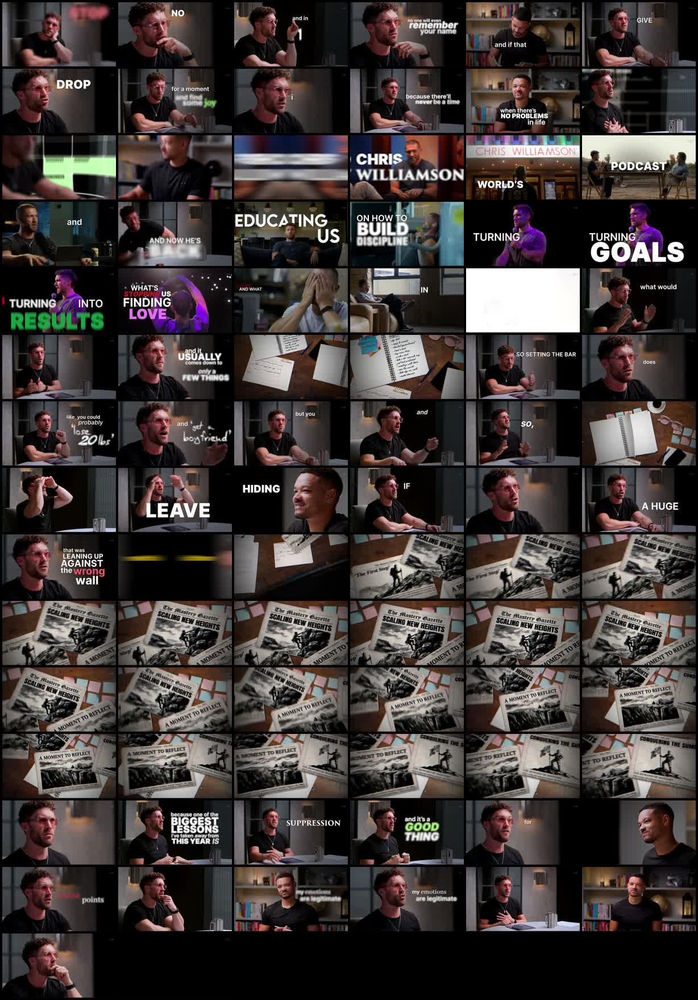
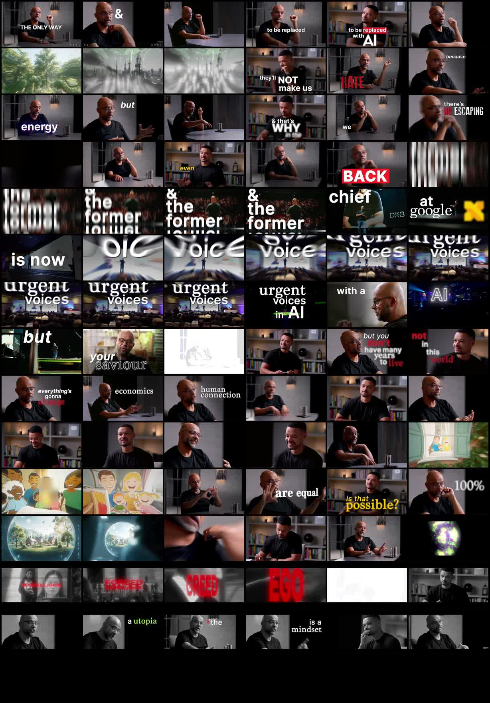
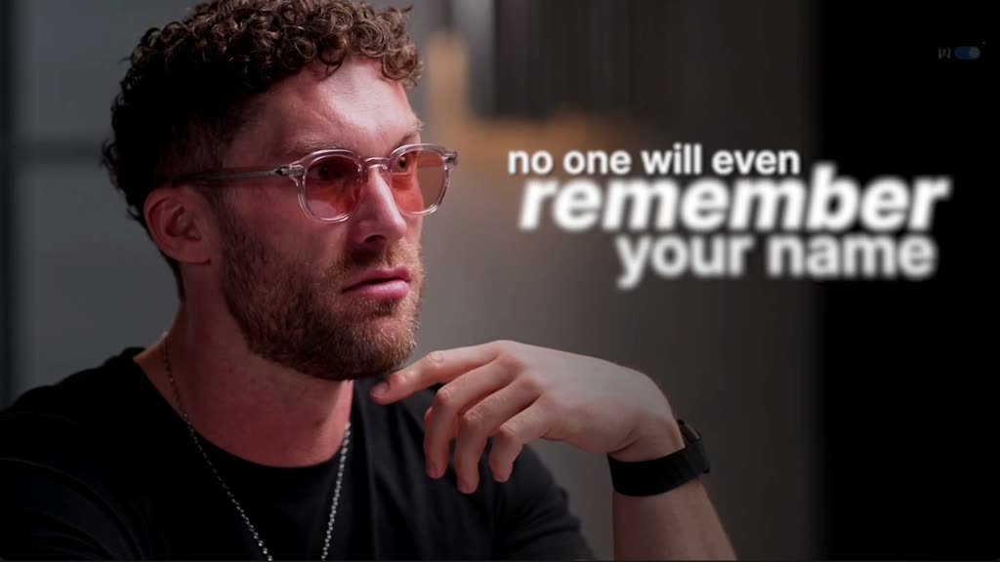
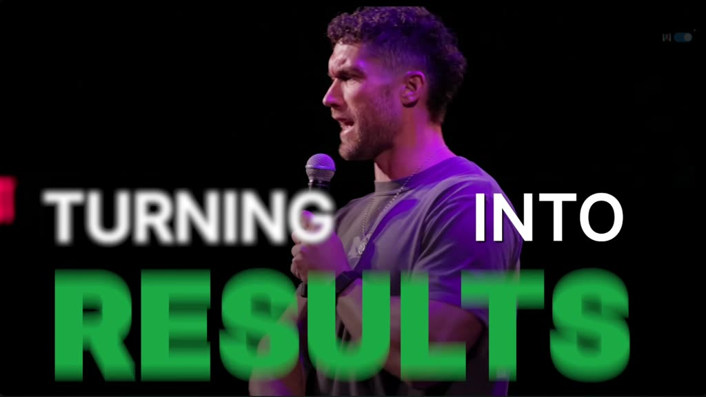
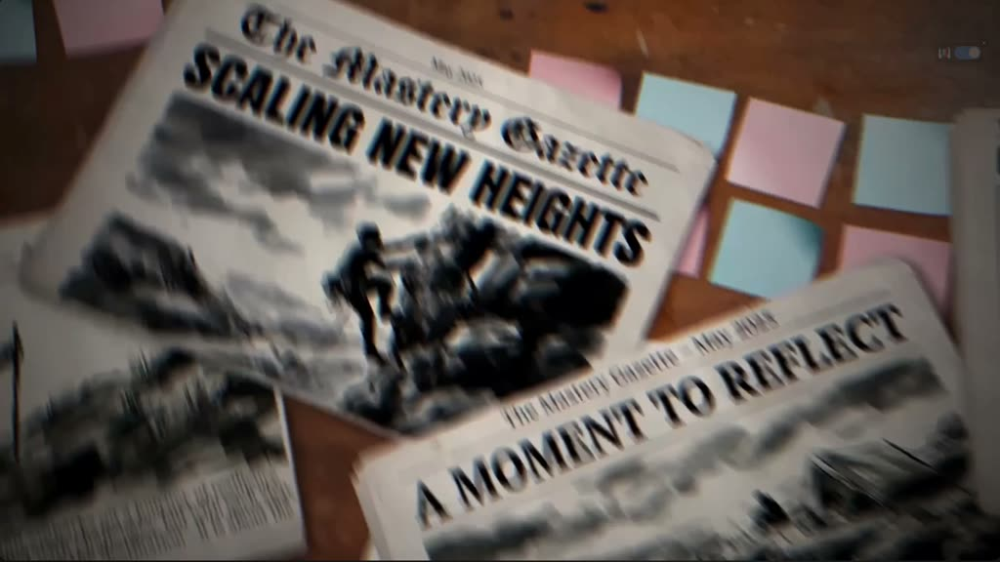
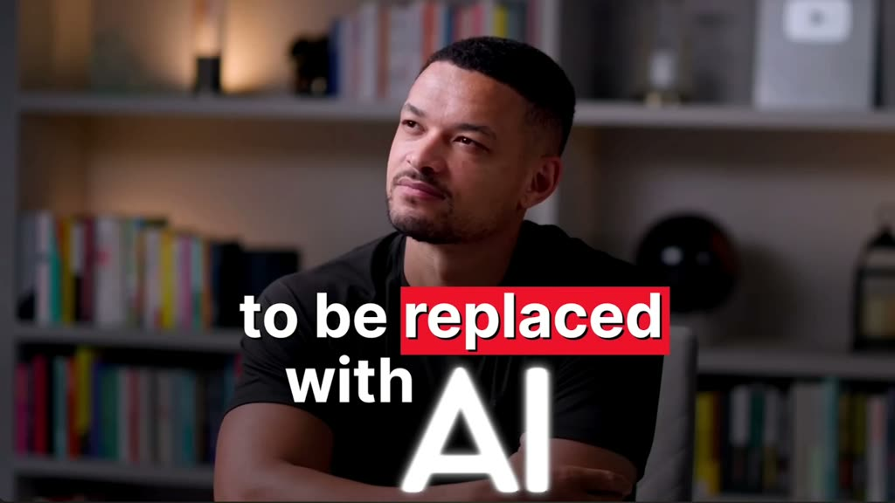
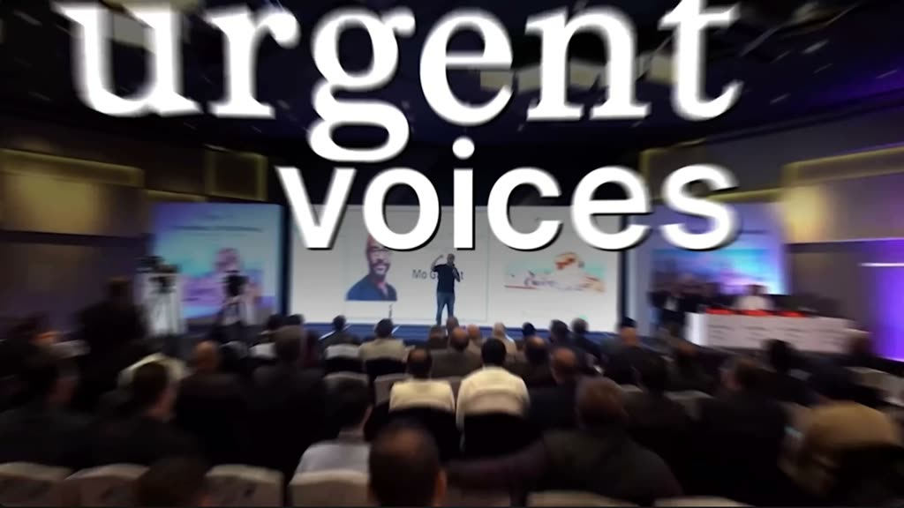
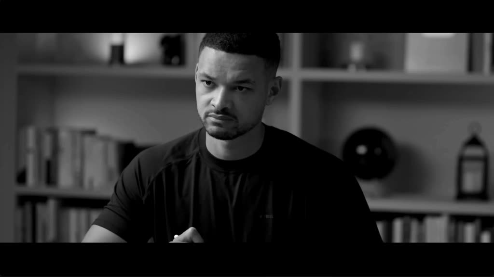

# DOAC Visual Reference

These screenshots come from the actual Diary of a CEO intro clips we analyzed, not from the tutorials.

## Contact Sheets

Use these to see the overall rhythm: talking head, big captions, B-roll, guest credibility, dramatic dark frames, and cliffhanger-style text.

## Caption And Visual Patterns

### Big White Caption On Dark Talking Head

Pattern:

- dark cinematic interview frame
- large white emphasis words
- caption does not cover every word equally
- text feels like trailer typography, not normal subtitles

### Green Emphasis Word

Pattern:

- mostly white uppercase caption
- one key word gets bright color
- important word is larger and heavier
- useful for emotional or motivational payoff words

### B-Roll / Editorial Insert

Pattern:

- visual insert supports the story
- not just random stock footage
- creates documentary/trailer texture
- can wait until after MVP because caption/story selection matters first

### White Caption With Red Keyword

Pattern:

- white text for normal words
- red keyword for danger/urgency
- caption is integrated into the shot composition

### Full-Frame Credential / Topic Card

Pattern:

- text becomes the main visual object
- B-roll/event footage provides authority
- large typography gives the trailer a premium documentary feel

### Red Single-Word Emphasis

Pattern:

- one word dominates the frame
- red creates emotional danger
- good for cliffhanger, conflict, fear, or identity words

## MVP Caption Direction For OpenShorts

For the first Podcast Trailer version, the caption template should aim for:

- bold uppercase typography
- white base text
- one accent word per phrase when useful
- accent colors like blue, green, yellow, or red based on emotion
- darkened/blurred background when text needs focus
- phrase-by-phrase timing
- occasional full-screen text moments

Do not try to copy every advanced B-roll/transition detail first. The MVP should prove the selected moments and caption style work.
